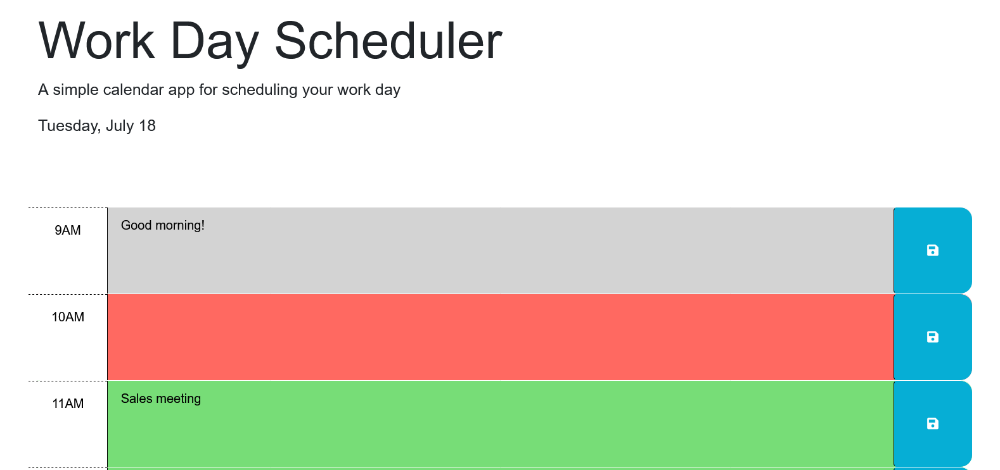

# Work Day Scheduler

A simple calendar application that allows a user to save events for each hour of a typical working day. 

## Functionality

The basic logic of the app is as follows:

```
GIVEN I am using a daily planner to create a schedule
WHEN I open the planner
THEN the current day is displayed at the top of the calendar
WHEN I scroll down
THEN I am presented with time blocks for standard business hours of 9am to 5pm
WHEN I view the time blocks for that day
THEN each time block is color-coded to indicate whether it is in the past, present, or future
WHEN I click into a time block
THEN I can enter an event
WHEN I click the save button for that time block
THEN the text for that event is saved in local storage
WHEN I refresh the page
THEN the saved events persist
```

## Mock-Up

The application should look like this:



## Deployed Application

The deployed application is [here](https://giancarlow333.github.io/work-day-scheduler/).

## Sources

* The datetime parsing code is from [Day.js](https://day.js.org/).
* I consulted [this StackOverflow thread](https://stackoverflow.com/questions/3239598/how-can-i-get-the-id-of-an-element-using-jquery) on getting an object's id via jQuery.
* I used the code from user Adil in [this StackOverflow thread](https://stackoverflow.com/questions/13068225/parsing-text-with-jquery) (with slight modifications) to parse the text in the id retrieved above.
* I consulted [this StackOverflow thread](https://stackoverflow.com/questions/40791207/setting-and-getting-localstorage-with-jquery) about accessing local storage with jQuery.


---
Written by Giancarlo Whitaker, 2023
